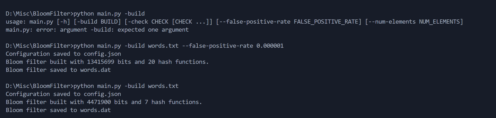
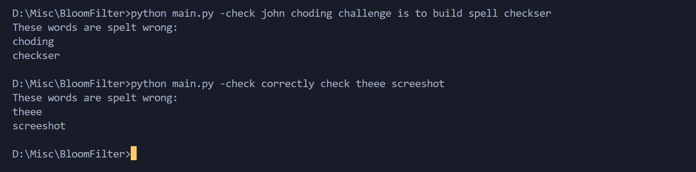

# Spell Checker Using Bloom Filter

## What is bloom filter?
[](https://www.youtube.com/watch?v=7oyxBiou9X8)

Simple implementation of Bloom Filter Using Murmur Hash.

Thanks to John Crickett for his [Coding Challenge](https://codingchallenges.substack.com/p/coding-challenge-53-bloom-filter)

## How to use?
```bash
python main.py -build words.txt --false-positive-rate 0.00001
python main.py -check words list
```

## Screenshots



