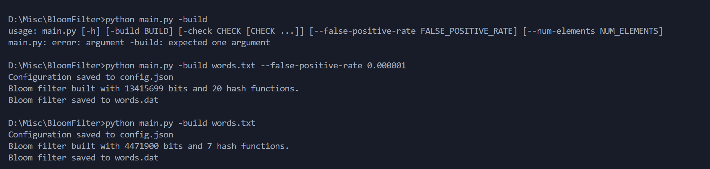
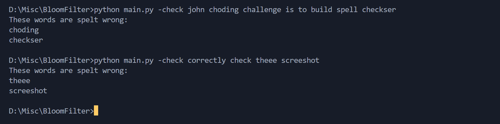

# Spell Checker Using Bloom Filter

A Bloom filter–backed spell checker, extended past the standard textbook
implementation to handle the failure mode every fixed-size Bloom filter
eventually hits in production: **saturation**.

## What is a Bloom filter?

[](https://www.youtube.com/watch?v=7oyxBiou9X8)

A probabilistic set-membership structure. It can tell you **definitely not
in the set** with 100% certainty, or **probably in the set** with a tunable
false-positive rate. It never produces false negatives — only false
positives, caused by hash collisions between different elements sharing
bit positions in the underlying bit array.

Implemented here using `k` seeded MurmurHash3 (`mmh3`) calls instead of `k`
separate hash algorithms — fast, well-distributed, and the standard
real-world approach.

Original implementation done as part of John Crickett's
[Coding Challenge #53](https://codingchallenges.substack.com/p/coding-challenge-53-bloom-filter).

## The problem with a single fixed-size filter

A Bloom filter is sized for an expected number of elements `n` at a target
false-positive rate `p`. If you insert significantly more than planned, the
bit array fills up — false-positive rate climbs, and the filter degrades
**silently**. It doesn't error out; it just gets less and less useful, and
nothing in the basic implementation tells you this is happening.

You also can't resize a Bloom filter's bit array in place. The array isn't
just storing the elements — it *is* the data, via overlapping hash
positions. There's no element list to "replay" into a bigger array without
keeping a separate copy of every original element, which defeats the whole
point of using a Bloom filter.

This project handles that gap with two additions: **live fill-ratio
monitoring** and a **scalable (chained) filter** that grows automatically
instead of saturating.

## Features

- **Standard Bloom filter** — `add`, `contains`, auto-sized `m` (bits) and
  `k` (hash functions) from a target false-positive rate.
- **Live stats** — `fill_ratio()` and `estimated_false_positive_rate()`,
  computed from the actual current state of the bit array (not just the
  target FPR it was built for). Exposed via `-stats`.
- **Scalable Bloom Filter** — when the active filter's fill ratio crosses a
  configurable threshold (default 50%), a new filter is appended to a chain
  instead of resizing in place. Inserts go to the newest filter; lookups
  check the whole chain. Exposed via `--scalable`.
- **Empirical validation** (`validate.py`) — measures the *actual* observed
  false-positive rate against the theoretical formula, across real probe
  words. Confirms the math holds for this implementation, not just on paper.
- **Benchmark vs `set`** (`validate.py`) — memory and lookup-speed comparison
  against a native Python `set` for the same word list, with real numbers.
- **Disk persistence** — filter state (including insertion count) is
  pickled to disk, so checks don't require rebuilding from the word list
  every run.

## How to use

### Standard (single, fixed-size filter)

```bash
python main.py -build words.txt --false-positive-rate 0.01
python main.py -check correctly check theee screeshot
python main.py -stats
```

### Scalable (chained, grows automatically under load)

```bash
python main.py -build words.txt --false-positive-rate 0.01 --scalable --growth-threshold 0.5
python main.py -check correctly check theee screeshot --scalable
python main.py -stats --scalable
```

### Validate false-positive rate against theory

```bash
python validate.py --word-file words.txt --mode fpr --trials 50000
```

```
--- False Positive Rate Validation ---
Words inserted:      466,549
Target FPR:          0.01
Bits / hash funcs:   4,471,900 / 7
Trials run:          50,000
False positives:     494
Observed FPR:        0.009880
Theoretical FPR:     0.010055
Delta:               0.000175
```

### Benchmark against a Python set

```bash
python validate.py --word-file words.txt --mode benchmark
```

```
--- Bloom Filter vs Python set Benchmark ---
Word count: 466,549

Metric                BloomFilter       Python set
Memory (MB)           0.533             38.435
Build time (s)        1.0181            0.0713
Avg lookup (µs)       1.516             0.119

Bloom filter uses ~72.1x less memory than a Python set.
```

The Bloom filter trades slower per-lookup time (multiple hash computations
per check vs. native hash table lookup) for roughly **72x lower memory
usage** — the core trade-off this data structure exists to make.

Note: the FPR numbers above will vary slightly run to run since
`validate.py` generates random probe words each time — expect the observed
rate to land within roughly 0.02% of the theoretical prediction, not an
exact match.

## How the scalable filter works

```
add(item):
  if active_filter.fill_ratio() >= growth_threshold:
      create a new filter sized for (growth_factor × current insert count)
      this new filter becomes the active filter
  active_filter.add(item)

contains(item):
  return True if ANY filter in the chain says True
  return False only if ALL filters say False
```

This is the same pattern used by production Bloom filter libraries (e.g.
scalable Bloom filters in Redis-adjacent tooling) to avoid the silent
degradation a single static filter suffers under unplanned growth.

```
--- Scalable Bloom Filter Stats ---
Number of filters in chain: 2
Growth threshold:            0.5
Total bits across chain:     12,957,150
Total elements inserted:     466,549

Filter 0:
  bits=4,471,900  hashes=7  inserted=442,629  fill_ratio=0.5  est_fpr=0.00781252
Filter 1 (active):
  bits=8,485,250  hashes=7  inserted=23,920  fill_ratio=0.019538  est_fpr=0.0
```

## Known limitations (not yet implemented)

- **No deletes.** Bits only flip 0 → 1, never back. A counting Bloom filter
  (small counters instead of single bits) would be needed to support
  deletion — left as a future extension.
- **Single-process.** The scalable filter chain lives in one process /
  one file. A distributed deployment (filter state shared or synced across
  machines) is a separate, larger problem.

## Screenshots




